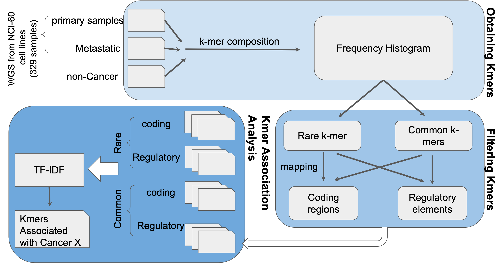

### **Kvar** is a pipeline for finding low frequency kmers in genomic data associated with disease. 

## Description

The overall goal is to find low-frequency and consensus-level kmers that are associated with certain disease phenotypes. So far we have outlined a pipeline for doing this in the slides and it goes something like: 1. get kmers; 2. filter kmers (based on frequency/location); and after running on a balanced set of disease & non-disease, 3. find kmers associated with disease phenotype. As a proof of principle, the team is using cancer samples pulled from WGS from NCI-60 cell lines (329 samples) using the SRA.



## Introduction

Identifying k-mers—substrings of length _k_—is a common bioinformatics technique, including applications in genome and transcriptome assembly, error correction of sequencing reads, and taxonomic classification of metagenomes. More recently, k-mers have been used for genotyping of structural variations in large datasets in a mapping-free manner. 

Sample comparison based on k-mers profiles provides a computationally efficient mapping-free way to address key differences between two biological conditions, avoiding the limitations of mappability and errors in the reference genome. Of particular interest are case-control studies, that allow to pinpoint genetic loci putatively implicated with a phenotype or a disease.

Here we develop a pipeline that takes as input samples sequencing data from to two conditions, and compares their k-mer profiles, highlighting k-mers that are relevant to distinguish between the datasets. We used this approach in a panel of cancer cell lines NCI-60 comparing between primary versus metastatic tissue to highlight mutational signatures underlying cancer progression.

## Methods

**Dataset description.** As a proof of concept, we used whole exome sequencing (WES) of the NCI-60 dataset, a panel of 60 different human tumor cell lines widely used for the screening of compounds to detect potential anticancer activity.

**K-mer counting.** K-mer frequencies were obtained for each sample, using the tool Jellyfish. First, counts of k-mers of size 31 were obtained with `jellyfish count` . Using a custom script, k-mers sequence and counts were tabulated to facilitate downstream analyses. The frequency distribution were plotted using R, and low frequency k-mers likely arising from sequencing errors were removed.

**Relevant k-mers selection.** TBD

## USAGE

* General Usage
```
EXAMPLE OF HOW TO USE THE FULL PIPELINE WILL GO HERE, PATIENCE IS KEY ;)
```
* Example Usage
```
EXAMPLE OF HOW TO USE THE FULL PIPELINE WILL GO HERE, PATIENCE IS KEY ;)
```

